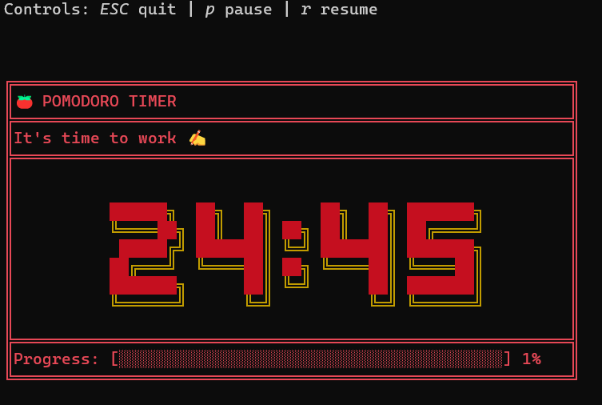

# 🍅 Pomodoro
A simple command-line pomodoro application written in Rust 🦀

# 📖 Instructions for Use

1. Open Powershell and navigate to the directory containing the [downloaded](https://github.com/adamcseresznye/pomodoro/releases) `pomodoro.exe` executable. For example:
   `cd "C:\Users\MyUserName\folder_pomodoro"`

2. Run 🍅 pomodoro:
   `.\pomodoro`

3. Press `ESC` to quit, `p` to pause and `r` to resume the application.

4. Be productive ✍️🎆🤯

