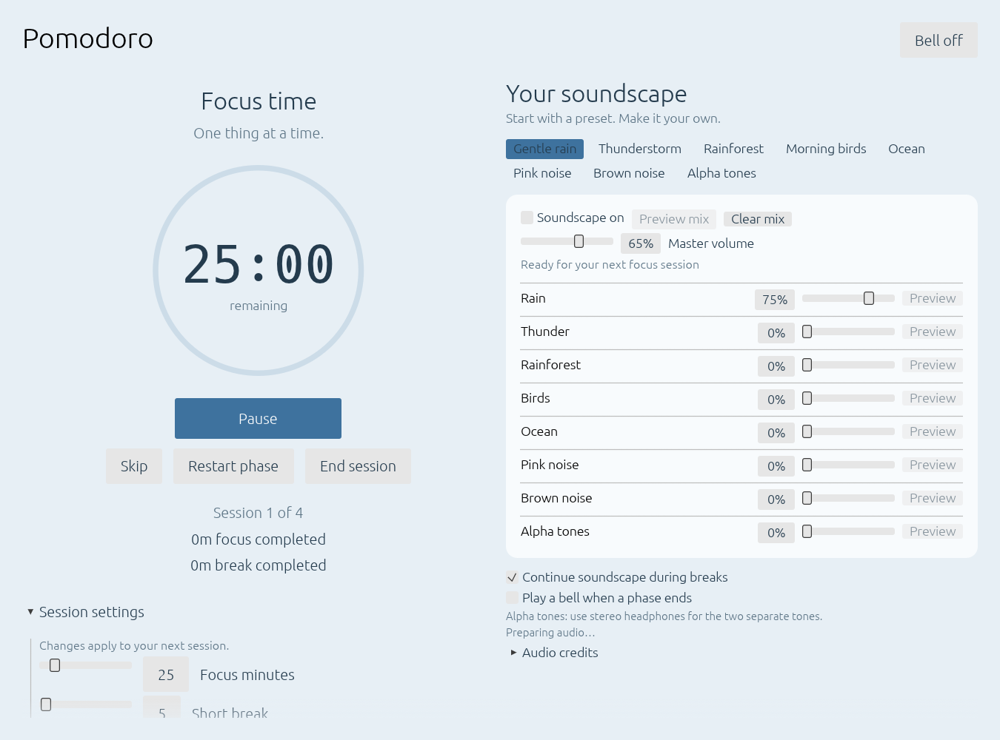

# Pomodoro Soundscapes

A Rust desktop timer built with egui and eframe. A clear countdown, clickable
controls, and an offline soundscape mixer help you set your atmosphere.
The original terminal interface is also available.



- Focus, short-break and long-break timers with a progress ring and centered controls.
- Eight sounds to combine: rain, thunder, rainforest, birds, ocean, pink noise,
  brown noise and alpha tones.
- Independent layer levels, master volume, eight presets and audio previews.
- Session settings beneath the clock, available before and during a session.
- Saved preferences, keyboard shortcuts and optional desktop notifications.
- Offline playback with bundled recordings and generated noise and tones.

## Download

Download **pomodoro-soundscapes-windows-x64.exe** from the
[latest release](https://github.com/adamcseresznye/pomodoro/releases/latest)
and open it on Windows. No installation or separate audio files are needed.

## Build requirements

Install [Rust](https://www.rust-lang.org/tools/install) with Cargo.
On Windows, use the MSVC toolchain with Visual Studio Build Tools (Desktop
development with C++) and the Windows SDK. The SDK resource compiler embeds
the app icon into the executable.

Linux builds also need development libraries for ALSA and the window system.
On Ubuntu/Debian:

```sh
sudo apt install build-essential pkg-config libasound2-dev libx11-dev libxi-dev libxcursor-dev libxrandr-dev libxinerama-dev libwayland-dev libxkbcommon-dev libgl1-mesa-dev
```

## Run

```powershell
git clone https://github.com/adamcseresznye/pomodoro.git
cd pomodoro
cargo run
cargo run -- --work 50 --short 10 --long 30 --cycles 3
cargo run -- --terminal
cargo build --release
```

Open `target/release/pomodoro.exe` to launch the desktop window. Change focus,
break lengths, and session count before starting. Choose a soundscape preset or mix your own background audio.

**Session settings** is expanded by default beneath the clock. Set focus and
break lengths, the number of sessions, automatic phase starts and desktop
notifications. Changes made during a running session are saved for the next
session; the current countdown continues unchanged. On smaller windows, scroll
to reach the remaining settings.

Pause, resume, skip, restart, end a session, and control background audio and the bell independently.
A finished session shows totals and offers a new session. Timing continues
while the desktop window is minimized. Sound and desktop notifications mark
phase changes. Skipped phases do not add to completed-session totals.

## Make it your space

Use **Appearance** for dark mode, custom colors, gradients, and grain, linen, or
dot textures. Background colors adjust for readable text. **Atmospheres** pairs
backgrounds with sound mixes: try Rainy evening, Forest morning, or Ocean calm,
or name and save your own. Save with the same name to update an atmosphere.

Add a session intention before starting. **Focus view** keeps the clock,
intention, and essential controls visible; **Show everything** restores settings.
Daily totals show completed focus sessions and minutes, saved across launches
and grouped by your computer's local date. Skips do not count. Audio eases in
and out over two seconds when playback or the mix changes.

## Keyboard shortcuts

| Key | Action |
|---|---|
| Space / Enter | Start, pause, resume, or continue |
| P / R | Pause / resume |
| S / N | Skip phase |
| X | Restart phase |
| M | Toggle notification bell |
| Q / Escape | End session; close from the summary |

## Command-line options

| Option | Purpose |
|---|---|
| `--work MIN` | Focus length, 1–180 minutes (default 25) |
| `--short MIN` | Short break, 1–180 minutes (default 5) |
| `--long MIN` | Long break, 1–180 minutes (default 15) |
| `--cycles N` | Sessions before a long break, 1–12 (default 4) |
| `--auto` | Start immediately and advance phases automatically |
| `--muted` / `--no-sound` | Start with the notification bell off |
| `--no-desktop` | Disable desktop notifications |
| `--terminal` | Use the original terminal interface |
| `--help` | Show command-line help |

## Validation

```powershell
cargo test
```

The desktop window and Windows executable use the icon in `assets/app-icon.png`
and `assets/app-icon.ico`; the vector design is in `assets/app-icon.svg`.

Optional developer screenshot build: `cargo build --features ui-preview`.
Set `EFRAME_SCREENSHOT_TO` to a PNG path before launching that build to capture
the initial window and exit. The ordinary release build does not enable this.

## Soundscapes

The desktop interface offers rain, thunder, rainforest, birds, ocean, pink
noise, brown noise and alpha tones. Choose a preset, adjust each layer and
master volume, or preview a layer or the full mix for eight seconds.
The default master volume is 65%. Output includes a gain boost for the ambient
recordings and smooth peak limiting when multiple layers are combined.

Playback follows the focus timer and pauses when the timer pauses. Select
Continue soundscape during breaks to keep listening during break phases.
Background audio and the notification bell have independent controls.
Recordings are embedded in the executable: no account or network is needed.
Preset, layer levels, master volume, playback options, bell and session settings
are saved in `%APPDATA%/pomodoro-soundscapes/preferences.json` on Windows.

Alpha tones play a 200 Hz tone in the left channel and 210 Hz in the right.
Use stereo headphones to hear the two channels separately. This is an audio
option, with no claimed concentration or health effect.

## Audio credits

Rain, thunder, birds and ocean recordings: BigSoundBank, CC0 1.0.
Rainforest: Jungle Sound Thailand Phuket by Amada44, CC BY-SA 3.0.
See [audio licenses](assets/sounds/LICENSES.md) and [exact sources](assets/sounds/sources.json).
Noise and tones are generated directly by the app.

## Releases

The [Windows release workflow](.github/workflows/release.yml) runs when a
version tag such as `v0.4.0` is pushed. It checks formatting, runs tests, builds
the Windows executable and publishes it with a SHA-256 checksum on the GitHub
release page. The tagged source remains available alongside the executable.
The workflow can also be run manually to produce a downloadable build artifact.
